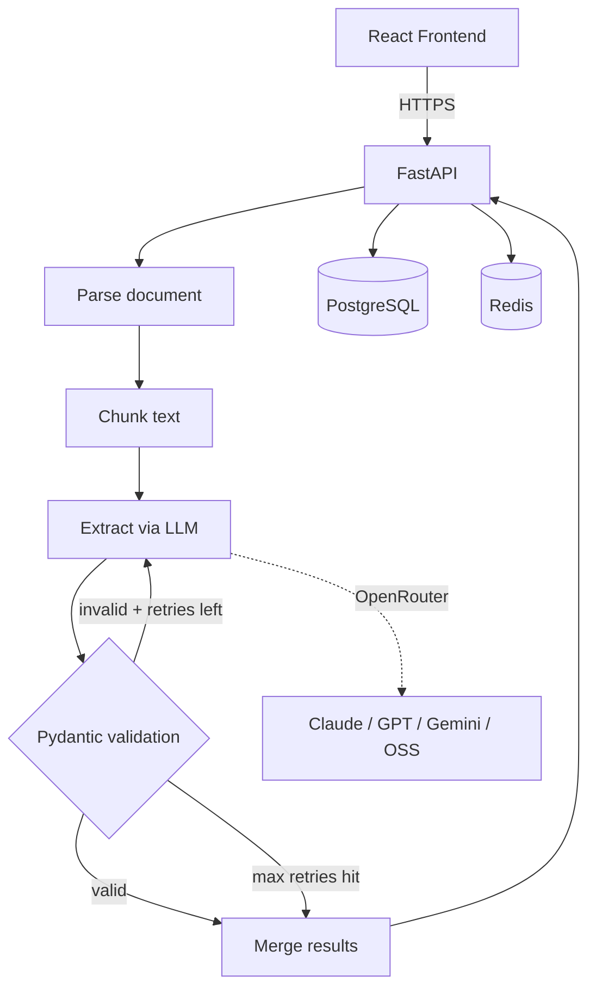

# DocForge

Upload a document → a LangGraph workflow extracts structured JSON against a Pydantic schema, retrying on validation failure → progress streams to a React frontend over SSE.

**[Live demo](https://docforge.nstoug.com)** · **[API docs](https://docforge.nstoug.com/docs)** · 

---

## What it is

A project built to explore self-correcting LLM extraction workflows in LangGraph. The interesting bit isn't the upload-and-parse — it's that when the LLM's output fails Pydantic validation, the validation errors are fed back to the LLM as part of the retry prompt (up to three retries). This pattern keeps extraction reliable even with smaller, cheaper models.

The system ships with three pre-built schemas (Invoice, Resume/CV, Research Paper) and lets you define custom ones as JSON Schema.

---

## Architecture



The workflow is a LangGraph state machine. Conditional edges route on Pydantic validation: valid → merge, invalid + retries left → re-extract with errors fed back into the prompt, max retries hit → return what we have.

---

## Stack

| Layer | Choice |
|---|---|
| Backend | FastAPI · Pydantic v2 · Python 3.12 |
| Workflow | LangGraph (state graph, conditional edges, structured output) |
| LLM routing | OpenRouter (Claude, GPT, Gemini, OSS) — BYOK supported |
| Storage | PostgreSQL 15 · Redis 7 (rate limiting) |
| Frontend | React 19 · TypeScript · Vite · Tailwind |
| Tooling | `uv` · `npm` · Ruff · Pyright (strict) · Vitest |
| Infra | Docker · Alembic · Nginx · GitHub Actions → ARM64 VPS |

---

## Quick start

Requires Docker and an [OpenRouter API key](https://openrouter.ai/keys) (or a direct provider key, used as BYOK).

```bash
cp .env.example .env       # add OPENROUTER_API_KEY
docker compose up --build
# API:      http://localhost:8000/docs
# Frontend: http://localhost:5173
```

---

## API at a glance

| Method | Path | Description |
|---|---|---|
| `GET`  | `/api/health` | Health check |
| `GET`  | `/api/schemas` | List extraction schemas |
| `POST` | `/api/schemas` | Create a custom schema |
| `POST` | `/api/extract` | Upload a document + start extraction |
| `GET`  | `/api/extract/{id}/stream` | SSE stream of node-by-node progress |
| `GET`  | `/api/extract/{id}/result` | Final structured result |

Full interactive docs at `/docs` (Swagger UI). Demo mode rate-limits at 10 extractions/hour/IP and whitelists a small set of low-cost models. Passing your own key via `X-API-Key` bypasses both.

---

## Development

```bash
# Backend
cd backend && uv sync --extra dev
uv run uvicorn app.main:app --reload     # :8000
uv run alembic upgrade head              # migrations

# Frontend
cd frontend && npm install
npm run dev                              # :5173
```

### Tests + quality gate

```bash
cd backend && uv run ruff check . && uv run ruff format --check . && uv run pyright . && uv run pytest -v
cd frontend && npm run lint && npm run build && npm run test
```

Both run in CI on every push (`.github/workflows/deploy.yml`).

---

## Environment variables

See `.env.example` for the full list. Minimum: `OPENROUTER_API_KEY`. Postgres + Redis defaults work as-is under Docker Compose.

---

## License

MIT
