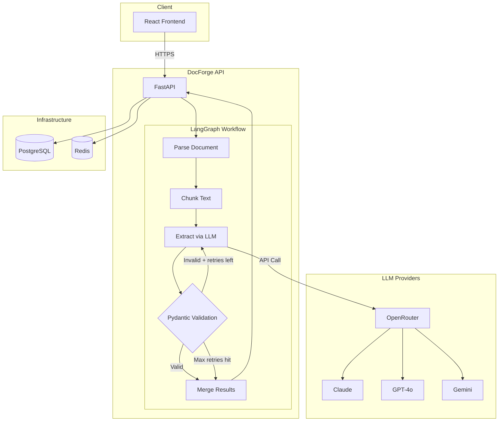

# DocForge

**AI-powered document intelligence API.** Upload documents, define extraction schemas, get structured, validated JSON — powered by a self-correcting LangGraph agent workflow.

**[Live Demo](https://docforge.nstoug.com)** · **[API Docs](https://docforge.nstoug.com/docs)** · **[Architecture](#architecture)**

---

## What It Does

DocForge extracts structured data from unstructured documents using LLMs. What makes it different from a simple API wrapper:

- **Self-correcting extraction**: A LangGraph workflow validates LLM output against your Pydantic schema. If validation fails, the errors are fed back to the LLM for retry (up to 3 retries). This is the pattern production AI systems use.
- **Schema-driven**: Define any extraction schema as JSON Schema. The system constructs extraction prompts dynamically.
- **Multi-provider**: Routes through OpenRouter to Claude, GPT-4o, Gemini, and open-source models. Bring Your Own Key (BYOK) supported.
- **Real-time streaming**: SSE (Server-Sent Events) shows extraction progress node-by-node as it happens.

### Example

Upload an invoice PDF with the "Invoice" schema selected → get back:

```json
{
  "vendor": "Acme Corp",
  "invoice_number": "INV-2026-0847",
  "date": "2026-03-15",
  "line_items": [
    {
      "description": "GPU Instance (A100)",
      "quantity": 3,
      "unit_price": 4500.00,
      "total": 13500.00
    }
  ],
  "subtotal": 13500.00,
  "tax": 3240.00,
  "total": 16740.00
}
```

### Demo


*A screen recording showing the full extraction flow: document upload, real-time LangGraph node progress, and the final structured JSON results.*

---

## Architecture



### Tech Stack

| Layer | Technology |
|-------|------------|
| API | FastAPI · Pydantic v2 · Python 3.12 |
| Agent Workflow | LangGraph · LangChain |
| LLM Routing | OpenRouter (multi-provider) |
| Database | PostgreSQL 15 · Redis 7 |
| Frontend | React 19 · TypeScript · Vite · Tailwind CSS |
| Infrastructure | Docker Compose · Nginx · Cloudflare SSL |
| CI/CD | GitHub Actions → Hetzner VPS (ARM64) |
| Package Management | uv |
| Code Quality | Ruff · Pyright · Pytest |

---

## Quick Start

### Prerequisites

- Docker & Docker Compose
- An [OpenRouter API key](https://openrouter.ai/keys) (or direct Anthropic/OpenAI/Google key)

### Run locally

```bash
# Clone
git clone https://github.com/niXtou/docforge.git
cd docforge

# Configure
cp .env.example .env
# Edit .env — add your OPENROUTER_API_KEY at minimum

# Start
docker compose up --build

# Access
# API:      http://localhost:8000/docs
# Frontend: http://localhost:3000
```

### Test the extraction API

```bash
# Upload a PDF and extract invoice data
curl -X POST http://localhost:8000/api/extract \
  -F "file=@sample-invoice.pdf" \
  -F "schema_id=1" \
  -F "model=google/gemini-2.0-flash-001"
# → {"job_id": "...", "status": "pending", ...}

# Stream progress node-by-node (SSE)
curl -N http://localhost:8000/api/extract/{job_id}/stream
# → event: node_completed  data: {"node": "parse", ...}
# → event: node_completed  data: {"node": "chunk", ...}
# → event: node_completed  data: {"node": "extract", ...}
# → event: node_completed  data: {"node": "validate", ...}
# → event: node_completed  data: {"node": "merge", ...}
# → event: done

# Get final result
curl http://localhost:8000/api/extract/{job_id}/result
# → {
#     "job_id": "...",
#     "status": "completed",
#     "data": { ... extracted fields ... },
#     "validation_passed": true,
#     "retries_used": 0,
#     "model_used": "google/gemini-2.0-flash-001",
#     "processing_time_ms": 4821,
#     "chunks_processed": 1
#   }
```

---

## API Reference

Full interactive documentation available at `/docs` (Swagger UI) when running the application.

### Core Endpoints

| Method | Path | Description |
|--------|------|-------------|
| `GET` | `/api/health` | Health check |
| `GET` | `/api/schemas` | List extraction schemas |
| `POST` | `/api/schemas` | Create custom schema |
| `POST` | `/api/extract` | Upload document + start extraction |
| `GET` | `/api/extract/{id}/stream` | Real-time SSE progress |
| `GET` | `/api/extract/{id}/result` | Final structured result |

### Pre-built Schemas

DocForge ships with three extraction schemas:

1. **Invoice** — vendor, line items, totals, dates
2. **Resume/CV** — name, experience, education, skills
3. **Research Paper** — title, authors, abstract, methodology, findings

Create custom schemas via the API or the web UI.

---

## Project Structure

```
docforge/
├── backend/
│   ├── app/
│   │   ├── api/          # FastAPI routes
│   │   ├── core/         # Config, database, LLM factory, security
│   │   ├── models/       # SQLAlchemy + Pydantic schemas
│   │   ├── services/     # Business logic
│   │   └── workflows/    # LangGraph — the core extraction engine
│   └── tests/
├── frontend/
│   └── src/
│       ├── components/   # React UI components
│       ├── hooks/        # Custom hooks (SSE consumer)
│       ├── api/          # API client
│       └── types/        # TypeScript type definitions
├── docker-compose.yml    # Local development
└── docker-compose.prod.yml  # Production
```

---

## Development

### Backend

```bash
cd backend
uv sync --extra dev             # Install dependencies (incl. dev tools)
uv run pytest -v                # Run tests
uv run ruff check .             # Lint
uv run pyright .                # Type check
```

### Frontend

```bash
cd frontend
npm install
npm run dev                     # Dev server on :3000
npm run test                    # Vitest
npm run build                   # Production build
```

### Code Quality

Pre-commit hooks enforce formatting and linting on every commit:

```bash
pre-commit install              # One-time setup
```

---

## Deployment

DocForge is designed for self-hosted deployment on a VPS with Docker Compose. The production setup includes:

- **Nginx gateway** — centralized reverse proxy (lives in a separate `hetzner-vps-portfolio-infra` repo) handling TLS termination with Cloudflare Origin Certificates; routes traffic to DocForge containers via a shared Docker network (`gateway_net`)
- **Docker Compose** — orchestrates backend, frontend, PostgreSQL, and Redis
- **GitHub Actions** — automated CI/CD on push to `main`; tests run on PRs, build+deploy gated to main
- **Rate limiting** — demo endpoint is rate-limited per hour and restricted to a curated set of low-cost models

See `docker-compose.prod.yml` for the production stack configuration.

---

## Key Design Decisions

**Why FastAPI over Django?** FastAPI is built on Pydantic — API models, LangGraph state, and extraction schemas all share the same type system. Async-first matters for LLM API calls. Auto-generated OpenAPI docs are a bonus.

**Why LangGraph over raw LangChain agents?** LangGraph provides explicit control over the workflow as a state machine. The self-correcting retry loop (conditional edges based on validation) is a first-class concept in LangGraph, whereas it would be ad-hoc in vanilla LangChain. In 2026, this remains the gold standard for reliable AI agentic workflows.

**Why OpenRouter?** Single API key routes to 200+ models. Users can switch between Claude, GPT-4o, and Gemini without managing separate credentials. BYOK is trivial — just pass a different key.

**Why self-hosted (not serverless)?** The extraction workflow runs for 5–30 seconds with streaming. This is a poor fit for serverless cold starts and execution limits. A VPS with Docker gives predictable performance, simplified background task management, and easier SSE handling.

---

## License

MIT

---

## Author

**Nikos Stougiannos** — [nstoug.com](https://nstoug.com) · [GitHub](https://github.com/niXtou)

*Built as a portfolio project demonstrating production-grade AI engineering with LangGraph, FastAPI, and modern Python tooling.*
